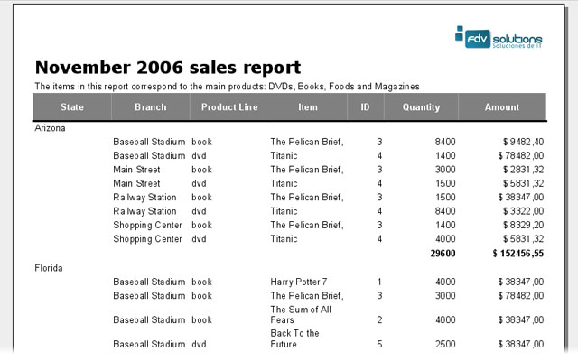
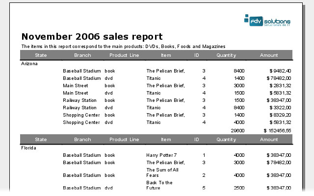
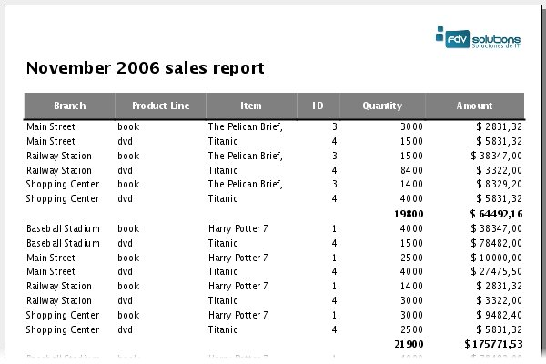
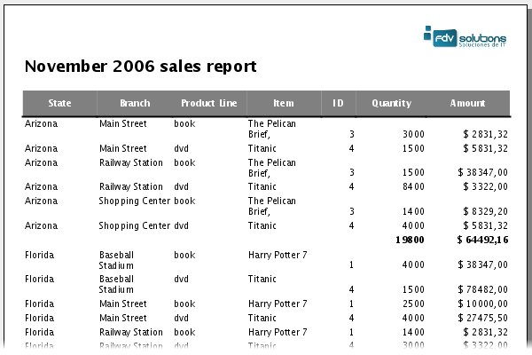
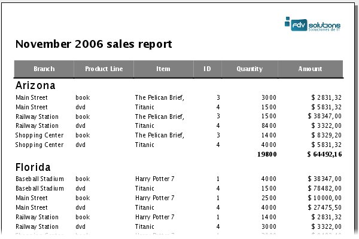
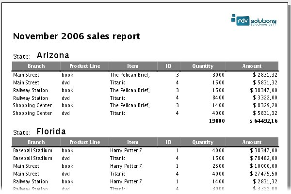
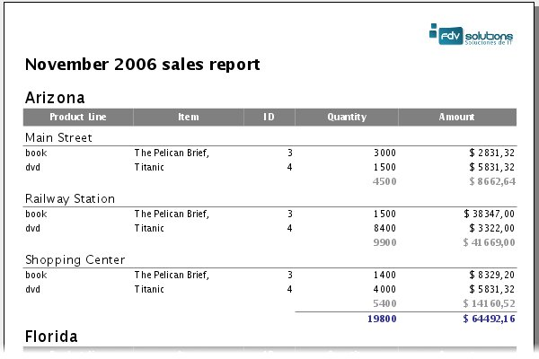

# Grouping Styles

DynamicJasper comes with predefined grouping layouts. Different combinations in layouts among nested groups can give to your reports a high visual impact.

## Content
- 1 group
    - [*Default* layout](#default_layout)
    - [*Default With Headers* (on each group break) Layout](#default_with_headers_on_each_group_break_layout)
    - [*Empty* layout (grouped column gets hidden)](#empty_layout_grouped_column_gets_hidden)
    - [Simple *Value For Each* layout](#simple_value_for_each_layout)
    - [Simple *Value For Each With Headers* layout](#simple_value_for_each_with_headers_layout)
    - [*Value In Header* layout](#value_in_header_layout)
    - [*Value In Header With Headers* layout](#value_in_header_with_headers_layout)
    - [*Value In Header With Headers And Column Name* layout](#value_in_header_with_headers_and_column_name_layout)
- 2 groups and more…
    - [*Value In Header With Header* and *Default* layouts](#value_in_header_with_header_and_default_layouts)
- [Layouts table](#layouts_table)

## The simplest case: 1 group

<a name="default_layout"></a>
### Default layout
**Code** [GroupsReportTestG1T1](https://github.com/intive-FDV/DynamicJasper/tree/master/src/test/java/ar/com/fdvs/dj/test/groups/GroupsReportTestG1T1.java)

```java
...
drb.setPrintColumnNames(true); // "drb" is the DynamicReportBuilder
...
ColumnsGroup g1 = gb1.setCriteriaColumn((PropertyColumn) columnState)
.addFooterVariable(columnAmount,ColumnsGroupVariableOperation.SUM,headerVariables)
.addFooterVariable(columnaQuantity,ColumnsGroupVariableOperation.SUM,headerVariables)
.setGroupLayout(GroupLayout.DEFAULT)
.build();
```

**Key Points**

|**Atribute**|**Value**|**Description**|
| :- | :- | :- |
|printColumnNames (on “drb”)|true|The column names will be shown at the top of each page|
|groupLayout (on group)|DEFAULT||
|footerVariable|SUM on column *Quanity* and *Amount*|On each group break, the sum of each column|

**Sample snapshot**



<a name="default_with_headers_on_each_group_break_layout"></a>
### *Default With Headers* (on each group break) Layout
**Code** [GroupsReportTestG1T2](https://github.com/intive-FDV/DynamicJasper/tree/master/src/test/java/ar/com/fdvs/dj/test/groups/GroupsReportTestG1T2.java)

```java
 ...
drb.setPrintColumnNames(false); // "drb" is the DynamicReportBuilder
 ...
ColumnsGroup g1 = gb1.setCriteriaColumn((PropertyColumn) columnState)
.addFooterVariable(columnAmount,ColumnsGroupVariableOperation.SUM,headerVariables)
.addFooterVariable(columnaQuantity,ColumnsGroupVariableOperation.SUM,headerVariables)
.setGroupLayout(GroupLayout.DEFAULT_WITH_HEADER)
.build();
```

**Key Points**

|**Atribute**|**Value**|**Description**|
| :- | :- | :- |
|printColumnNames (on “drb”)|false|Because each group prints its own header, we dont need this.|
|groupLayout (on group)|DEFAULT\_WITH\_HEADER||

**Sample snapshot**



<a name="empty_layout_grouped_column_gets_hidden"></a>
### *Empty* layout (grouped column gets hidden)
**Code** [GroupsReportTestG1T3](https://github.com/intive-FDV/DynamicJasper/tree/master/src/test/java/ar/com/fdvs/dj/test/groups/GroupsReportTestG1T3.java)

```java
...
drb.setPrintColumnNames(true); // "drb" is the DynamicReportBuilder
...

ColumnsGroup g1 = gb1.setCriteriaColumn((PropertyColumn) columnState)
.addFooterVariable(columnAmount,ColumnsGroupVariableOperation.SUM,headerVariables)
.addFooterVariable(columnaQuantity,ColumnsGroupVariableOperation.SUM,headerVariables)
.setGroupLayout(GroupLayout.EMPTY)
.build();
```
**Key Points**

|**Atribute**|**Value**|**Description**|
| :- | :- | :- |
|printColumnNames (on “drb”)|true|The column names will be shown at the top of each page|
|groupLayout (on group)|EMPTY|makes the column used as grouping criteria to be hidden. Note that on each group breaks there are totals for that group|

**Sample snapshot**



<a name="simple_value_for_each_layout"></a>
### Simple *Value For Each* layout
**Code** [GroupsReportTestG1T4](https://github.com/intive-FDV/DynamicJasper/tree/master/src/test/java/ar/com/fdvs/dj/test/groups/GroupsReportTestG1T4.java)

```java
...
drb.setPrintColumnNames(true); // "drb" is the DynamicReportBuilder
...

ColumnsGroup g1 = gb1.setCriteriaColumn((PropertyColumn) columnState)
.addFooterVariable(columnAmount,ColumnsGroupVariableOperation.SUM,headerVariables)
.addFooterVariable(columnaQuantity,ColumnsGroupVariableOperation.SUM,headerVariables)
.setGroupLayout(GroupLayout.VALUE_FOR_EACH)
.build();
```

**Key Points**

|**Atribute**|**Value**|**Description**|
| :- | :- | :- |
|printColumnNames (on “drb”)|true|The column names will be shown at the top of each page|
|groupLayout (on group)|VALUE\_FOR\_EACH|The column used as grouping criteria repeats its value on each row.|

**Sample snapshot**

[](http://web.archive.org/web/20220121074137/http://dynamicjasper.sourceforge.net/images/examples/grouping/1g-VALUE_FOR_EACH.jpg)

<a name="simple_value_for_each_with_headers_layout"></a>
### [Simple *Value For Each With Headers* layout]
**Code** [GroupsReportTestG1T5](https://github.com/intive-FDV/DynamicJasper/tree/master/src/test/java/ar/com/fdvs/dj/test/groups/GroupsReportTestG1T5.java)

```java
...
drb.setPrintColumnNames(false); // "drb" is the DynamicReportBuilder
...

ColumnsGroup g1 = gb1.setCriteriaColumn((PropertyColumn) columnState)
.addFooterVariable(columnAmount,ColumnsGroupVariableOperation.SUM,headerVariables)
.addFooterVariable(columnaQuantity,ColumnsGroupVariableOperation.SUM,headerVariables)
.setGroupLayout(GroupLayout.VALUE_FOR_EACH_WITH_HEADERS) // set layout style
.build();
```

**Key Points**

|**Atribute**|**Value**|**Description**|
| :- | :- | :- |
|printColumnNames (on “drb”)|false|Because every group break will add its own headers|
|groupLayout (on group)|VALUE\_FOR\_EACH\_WITH\_HEADERS|The column used as grouping criteria repeats its value on each row. Headers are printed on every group break.|

**Sample snapshot**

[](http://web.archive.org/web/20220121074137/http://dynamicjasper.sourceforge.net/images/examples/grouping/1g-VALUE_FOR_EACH_WITH_HEADERS.jpg)

<a name="value_in_header_layout"></a>
### *Value In Header* layout
**Code** [GroupsReportTestG1T6](https://github.com/intive-FDV/DynamicJasper/tree/master/src/test/java/ar/com/fdvs/dj/test/groups/GroupsReportTestG1T6.java)

```java
...
drb.setPrintColumnNames(true); // "drb" is the DynamicReportBuilder
...

columnState.setStyle(titleStyle); //Give a special style to the grouping column (bigger font)
...

ColumnsGroup g1 = gb1.setCriteriaColumn((PropertyColumn) columnState)
.addFooterVariable(columnAmount,ColumnsGroupVariableOperation.SUM,headerVariables)
.addFooterVariable(columnaQuantity,ColumnsGroupVariableOperation.SUM,headerVariables)
.setGroupLayout(GroupLayout.VALUE_IN_HEADER) // set layout style
.build();
```

**Key Points**

|**Atribute**|**Value**| **Description**                                                                                                           |
| :- | :- |:--------------------------------------------------------------------------------------------------------------------------|
|printColumnNames (on “drb”)|true| Just once on each page.                                                                                                   |
|groupLayout (on group)|VALUE\_IN\_HEADER| The grouping column gets hidden but on each group break the grouping column current value is printed in a separated line. |
|style (of the grouping column)|*A different style from the rest of the columns*|                                                                                                                           |

**Sample snapshot**

[](http://web.archive.org/web/20220121074137/http://dynamicjasper.sourceforge.net/images/examples/grouping/1g-VALUE_IN_HEADER.jpg)

<a name="value_in_header_with_headers_layout"></a>
### *Value In Header With Headers* layout
**Code** [GroupsReportTestG1T7](https://github.com/intive-FDV/DynamicJasper/tree/master/src/test/java/ar/com/fdvs/dj/test/groups/GroupsReportTestG1T7.java)

```java
...
drb.setPrintColumnNames(false); // "drb" is the DynamicReportBuilder
...

columnState.setStyle(titleStyle); //Give a special style to the grouping column (bigger font)
...

ColumnsGroup g1 = gb1.setCriteriaColumn((PropertyColumn) columnState)
.addFooterVariable(columnAmount,ColumnsGroupVariableOperation.SUM,headerVariables)
.addFooterVariable(columnaQuantity,ColumnsGroupVariableOperation.SUM,headerVariables)
.setGroupLayout(GroupLayout.VALUE_IN_HEADER_WITH_HEADERS) // set layout style
.build();
```

**Key Points**

|**Atribute**|**Value**|**Description**|
| :- | :- | :- |
|printColumnNames (on “drb”)|false|Because every group break will add its own headers|
|groupLayout (on group)|VALUE\_IN\_HEADER\_WITH\_HEADERS|The grouping column gets hidden but on each group break the grouping column current value is printed right before the headers.|
|style (of the grouping column)|*A different style from the rest of the columns*||

**Sample snapshot**

[](http://web.archive.org/web/20220121074137/http://dynamicjasper.sourceforge.net/images/examples/grouping/1g-VALUE_IN_HEADER_WITH_HEADERS.jpg)

<a name="value_in_header_with_headers_and_column_name_layout"></a>
### *Value In Header With Headers And Column Name* layout
**Code** [GroupsReportTestG1T8](https://github.com/intive-FDV/DynamicJasper/tree/master/src/test/java/ar/com/fdvs/dj/test/groups/GroupsReportTestG1T8.java)

```java
...
drb.setPrintColumnNames(false); // "drb" is the DynamicReportBuilder
...

columnState.setStyle(titleStyle); //Give a special style to the grouping column detail (bigger font)
columnState.setHeaderStyle(titleStyle); //Give a special style to the grouping column tile (bigger font)
columnState.setWidth(new Integer(85));

...

ColumnsGroup g1 = gb1.setCriteriaColumn((PropertyColumn) columnState)
.addFooterVariable(columnAmount,ColumnsGroupVariableOperation.SUM,headerVariables)
.addFooterVariable(columnaQuantity,ColumnsGroupVariableOperation.SUM,headerVariables)
.setGroupLayout(GroupLayout.VALUE_IN_HEADER_WITH_HEADERS_AND_COLUMN_NAME) // set layout style
.build();
```

**Key Points**

|**Atribute**|**Value**|**Description**|
| :- | :- | :- |
|printColumnNames (on “drb”)|false|Because every group break will add its own headers|
|groupLayout (on group)|VALUE\_IN\_HEADER\_WITH\_<br>HEADERS\_AND\_COLUMN\_NAME|The grouping column gets hidden but on each group break the grouping column current value is printed right before the headers.|
|style (of the grouping column)|*A different style from the rest of the columns*||
|heaedrStyle (of the grouping column)|*A different header style from the rest of the columns*||
|width (of the grouping column)|50|This layout uses the column width attribute to set the title with, the value gets the rest of space left.|

**Sample snapshot**

[](http://web.archive.org/web/20220121074137/http://dynamicjasper.sourceforge.net/images/examples/grouping/1g-VALUE_IN_HEADER_WITH_HEADERS_AND_COLUMN_NAME.jpg)

## Getting serious: 2 groups
As the number of group grows, different combinations of grouping layouts can result in high-end designs.

<a name="value_in_header_with_header_and_default_layouts"></a>
### *Value In Header With Header* and *Default* layouts
**Code** [GroupsReportTestG2T1](https://github.com/intive-FDV/DynamicJasper/tree/master/src/test/java/ar/com/fdvs/dj/test/groups/GroupsReportTestG2T1.java)

**Key Points**

|**Atribute**|**Value**|**Description**|
| :- | :- | :- |
|printColumnNames (on “drb”)|false|Because every group break will add its own headers|
|groupLayout (on group 1)|VALUE\_IN\_HEADER\_WITH\_HEADERS|The grouping column gets hidden but on each group break the grouping column current value is printed right before the headers.|
|groupLayout (on group 2)|VALUE\_IN\_HEADER|The grouping column gets hidden but on each group break the grouping column current value is printed in a separated line.|
|style (of the grouping column for group 1)|*A different style from the rest of the columns*||
|style (of the grouping column for group 2)|*A different style from the rest of the columns*||
|heaedrStyle (of the grouping column 1)|*A different header style from the rest of the columns*||
|heaedrStyle (of the grouping column 2)|*A different header style from the rest of the columns*||

**Sample snapshot**

[](http://web.archive.org/web/20220121074137/http://dynamicjasper.sourceforge.net/images/examples/grouping/2g-V_IN_H_WITH_H_vs_V_IN_H.jpg)

In this case, first group is using VALUE_IN_HEADER_WITH_HEADERS layout and second group is using VALUE_IN_HEADER

<a name="layouts_table"></a>
## Layouts Table
Combining of the different **GroupLayout** possibilities with nested groups can end in very interesting results

The following matrix shows the different aspects used in each template.

|**Template**|**show Value In Header**|**show Value For Each Row**|**show ColumnName**|**hide Column**|**printHeaders**|
| :-: | :-: | :-: | :-: | :-: | :-: |
|EMPTY|NO|NO|NO|YES|NO|
|DEFAULT|YES|NO|NO|NO|NO|
|DEFAULT\_WITH\_HEADER|YES|NO|NO|YES|NO|
|VALUE\_IN\_HEADER\_WITH\_HEADERS|YES|NO|NO|YES|YES|
|VALUE\_IN\_HEADER\_WITH\_HEADERS<br>\_AND\_COLUMN\_NAME|YES|NO|YES|YES|YES|
|VALUE\_FOR\_EACH|NO|YES|NO|NO|NO|
|VALUE\_FOR\_EACH\_WITH\_HEADERS|NO|YES|NO|NO|YES|
|VALUE\_IN\_HEADER\_AND\_FOR\_EACH|YES|YES|NO|NO|NO|
|VALUE\_IN\_HEADER\_AND\_FOR\_EACH\_WITH\_HEADERS|YES|YES|NO|NO|YES|

