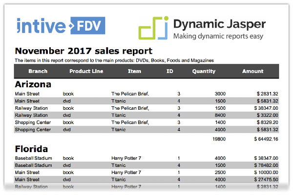

**DynamicJasper** (DJ) is an API that hides the complexity of [JasperReports](https://community.jaspersoft.com/project/jasperreports-library), it helps developers to save time when designing simple/medium complexity reports generating the layout of the report elements automatically. It creates reports dynamically, defining at run-time the columns, column width (auto width), groups, variables, fonts, charts, cross-tabs, sub reports (that can also be dynamic), page size and everything else that you can define at design time.

DJ keeps full compatibility with Jasper Reports since it’s a tool that helps create reports programmatically in an easy way (it only interferes with the creation of the report design doing the layout of the elements).

You can use the classic `.jrxml` files as templates while the content and layout of the report elements are handled by the DJ API.



# Documentation

- [Getting started](./getting-started.md): A guided walkthrough to your first report.
- [How-To guide](./how-to.md): A comprehensive compilation of examples covering every feature. 

# Maven Dependency

```xml
<dependency>
    <groupId>ar.com.fdvs</groupId>
    <artifactId>DynamicJasper</artifactId>
    <version>5.3.9</version>
</dependency>
```
Check for the latest version in [Maven Central Repository](https://mvnrepository.com/artifact/ar.com.fdvs/DynamicJasper)

# About DynamicJasper

## The "Report" Concept

This API is intended to solve the 99% of the classic reports that consist in a number of fields (that are going to be columns in the report), then the report may have some “repeating groups” defined using a field as a criteria. Some columns may have variables (with operations such as SUM or COUNT) for some of the fields. All this tasks can be done automatically by the DJ through a very easy-to-use API.

You can redefine at runtime the column order, “repeating groups”, variables, styles, conditional styles, etc. Its completely dynamic!!!

## Features

Most of the features are provided directly by Jasper Reports (great tool guys!), nevertheless through the DJ API some of the results are achieved with really no effort.

* 100% pure Java
* No need to use other tool than you favorite IDE.
* Friendly and intuitive API.
* Mature, robust and stable.

__Dynamic column report__: Columns can be defined at runtime, which means you also control (at runtime) the column positioning, width, title, etc.

__Repeating groups / Breaking groups__: Create repeating groups dynamically using simple expressions as criteria or complex custom expressions. Each repeating group may have a header and/or footer, which can have a variable showing the result of an operation (SUM, COUNT or any other provided by Jasper Reports).

__Automatic report layout__: Just define a minimum set of options and DJ will take care of the layout. It’s not an issue to generate the same report for different page sizes and orientation many more!

__Dynamic Crosstabs__: Jasper Report’s popular crosstabs can now be created dynamically in an easy and convenient way.

### Sub reports

Sub reports are supported; they can also be dynamically created.
Concatenating many reports in a single one (e.g.: a single PDF) can be a hard task. Using DynamicJasper it is really easy get reports of different nature in a single one.
Styles: Each column can have its own style for its title and detail data (defining border, border color, font size, type and color, background color, etc.).

* __Style library from jrxml__ files are supported.
* __Calculation Variables__: Repeating groups can have variables that hold the result of an operation on a given field (column). With DJ adding variables is a 1 line of code task.
* __JRXML template files support__: You can use a base template jrxml file in which common styles, company logo, water mark, etc can be pre defined.
* __Conditional Format__: DJ provides a very simple way to define conditional formats. You can use simple conditions or custom conditions.
* __Auto text__: Add auto text in page header and footer such as ?Page 1 of 10?, ?Generated on Oct. 10th 2007? or a custom text.
* __Charts__: Easy to add simple charts.
* __Barcode columns__: As simple as adding a regular column.
* __Export to most popular formats__: As DJ stands over Jasper Reports, it can export to PDF, XML, HTML, CSV, XLS, RTF, TXT.
* __Clean Excel export__: One of the most valuable features that DJ provides is exporting plain reports to excel, with no data formatting, no page break, etc. This is very valuable for end users that use this report to create dynamic tables in Excel, creating these reports just with Jasper Reports can demand a lot of design time.


## Open Source and Free (as free beer!)

* GitHub [repository](https://github.com/intive-FDV/DynamicJasper)
* License:  GNU LESSER GENERAL PUBLIC LICENSE V.3 ([details](./license.md))

# Brought to you by
[](https://intive.com/)

